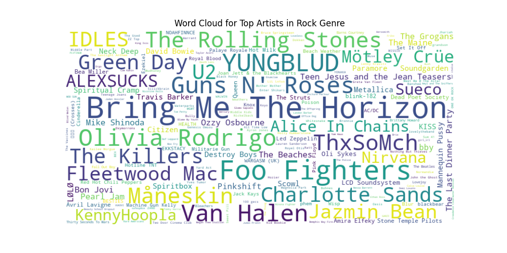

# Spotify and Genius Data Analysis Project

This project involves collecting and analyzing data from both Spotify and Genius to gain insights into music genres and lyrics. It consists of four main scripts:

1. `spotify_data_collection.py`: Collects data on top tracks from various music genres using the Spotify API.

2. `results_spotify.py`: Analyzes and visualizes data collected from Spotify, focusing on artist counts and generating word clouds for top artists in each genre.

3. `genius_lyrics_data_collection.py`: Collects lyrics data for songs using the Genius API and combines it with Spotify data.

4. `results_genius.py`: Analyzes and visualizes lyrics data, generating word clouds and bar charts to represent the most frequent words in lyrics for different music genres.

## Project Structure

- `data/`: Directory to store CSV files containing Spotify data.
  - `spotify/`: Stores CSV files containing Spotify data for different music genres.
  - `genius/`: Stores CSV files containing combined Spotify and Genius data with lyrics.
- `results/`: Directory to store images of the project results.

## Prerequisites

- Python 3.9.6
- Required Python libraries (specified in each script)
- Spotify API credentials
- Genius API access token

## How to Use

1. Ensure you have the necessary Python libraries installed.
2. Obtain your Spotify API credentials and Genius API access token.
3. Run the scripts in the following order:
   - `spotify_data_collection.py`
   - `results_spotify.py`
   - `genius_lyrics_data_collection.py`
   - `results_genius.py`

## Results

Here are some visualizations of the project results:

### Word Cloud for Pop Genre

### Bar Chart for Top 20 Words in Hip-Hop Lyrics

<!-- Add more visualizations here -->

## License

This project is licensed under the [MIT License](LICENSE).

## Acknowledgments

- The Spotify API and Genius API for providing access to music data.

## Author

- Your Name

Feel free to customize this `README.md` to provide specific details about your project, such as installation instructions, data sources, or any additional acknowledgments or references.
